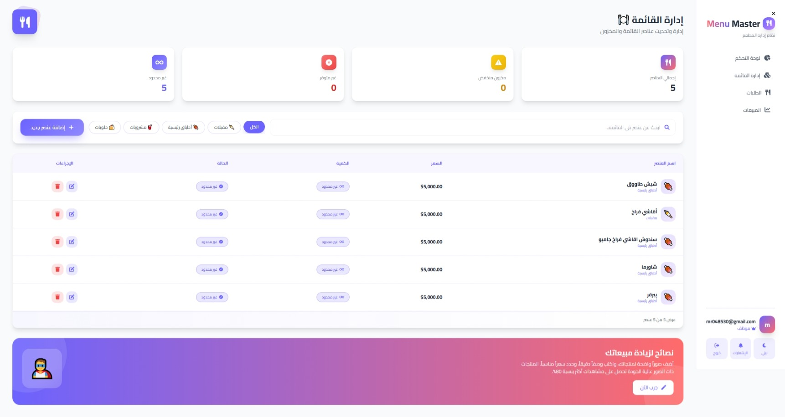
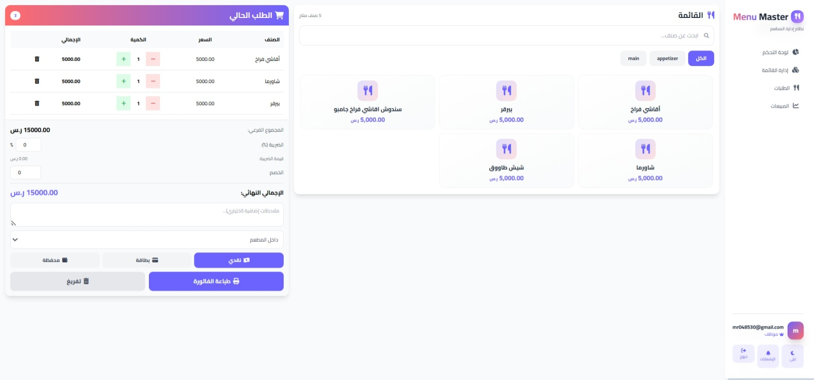
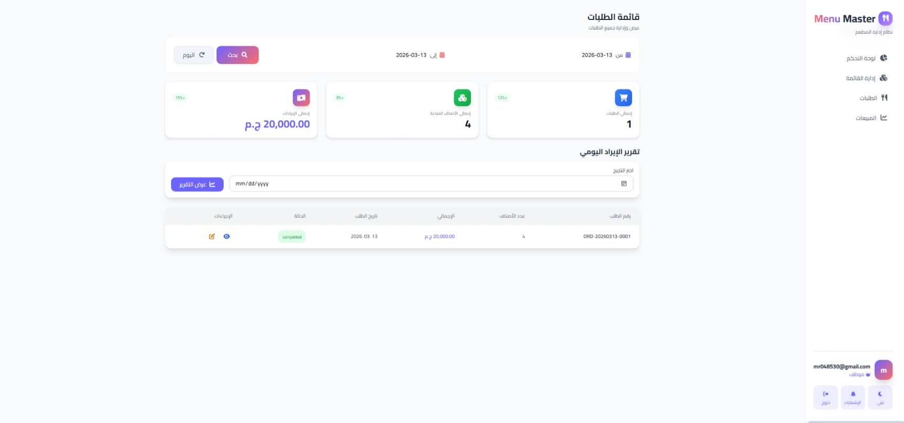
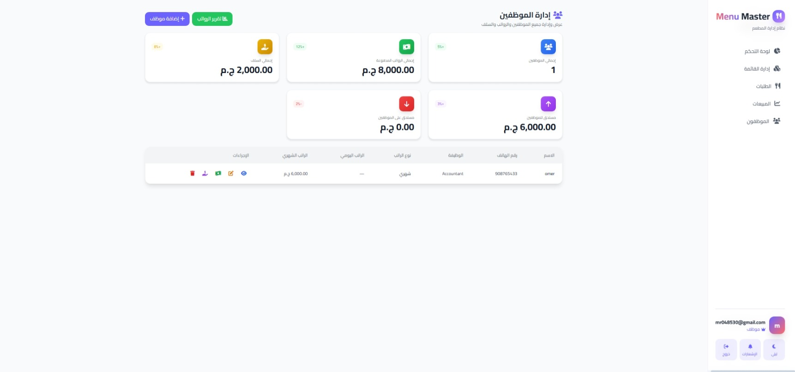

Restaurant POS System

Overview

This is a Point of Sale (POS) system designed for a restaurant to manage menu items, orders, and sales efficiently. The system allows staff to manage categories, menu items, take orders, print bills, and track sales in real-time.

Features

User Authentication

Register: New staff or admin can create an account.

Login: Authenticate users to access the POS system.

Role-Based Access: Assign roles (e.g., admin, staff) to control access to features.

Logout: Securely log out from the system.

Menu Management

Add Items: Add new dishes or products to the menu.

Edit Items: Update the details of existing menu items.

Delete Items: Remove items from the menu.

View Menu: Display all menu items with their categories.

Category Management: Organize items into categories for easier navigation.

Order Management

Create Order: Take orders for students/customers.

Update Order: Modify an existing order before finalization.

View Orders: Display all active and completed orders.

Print Invoice: Generate and print a receipt for each order.

Sales Management

View Total Sales: Show total sales to date.

Daily Sales: Display sales for a specific day.

Sales Reports: Generate reports for selected periods.

Usage

1. Register a new account (staff/admin).

2. Login using your credentials.

3. Navigate to the Menu Management section to add, edit, or delete menu items.

4. Go to Order Management to take or update orders.

5. Print the invoice for completed orders.

6. Access Sales Management to track daily or total sales.

Technologies

Backend: Laravel

Frontend: React.js / Blade templates

Database: MySQL

PDF/Print: TCPDF or similar library

Installation

1. Clone the repository.

2. Run composer install to install backend dependencies.

3. Run npm install for frontend dependencies.

4. Configure .env with database and application settings.

5. Run php artisan migrate --seed to create and seed tables.

6. Start the development server using php artisan serve.

Contributing

Fork the repository.

Create a new branch for your feature: git checkout -b feature-name.

Commit your changes and push the branch.

Open a Pull Request describing your changes.

License

This project is open-source and available under the MIT License.

# 🍽️ Restaurant POS System

## Overview
This is a Point of Sale (POS) system designed for a restaurant to manage menu items, orders, and sales efficiently. The system allows staff to manage categories, menu items, take orders, print bills, and track sales in real-time.

---

## Screenshots

### Dashboard

### Menu Management

### Order Management

### Sales Management

### employee

